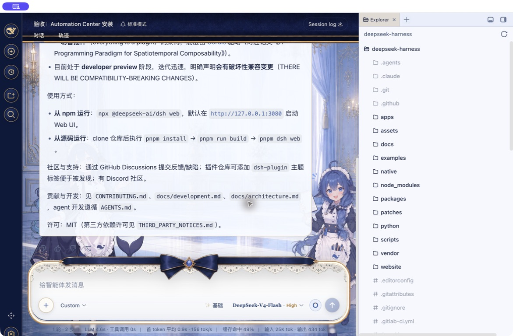

# DSH Automation Center

[中文](README.zh.md) | English


A global automation workspace for DeepSeek Harness. **Automations** is a root action directly below **New Session** and above **Workspaces**. It opens a full center page instead of living inside a Conversation or Trajectory tab.

Every occurrence creates a fresh root Agent and Result Session in the selected workspace. Automation Center owns definitions, schedules, permissions and run history; the Result Session owns the complete result and audit trail. Its title is pinned to the automation task name rather than the workspace/project name.

> Current release: `0.1.0-alpha.2`. It requires the companion DSH shell patch and is not compatible with an unmodified upstream `0.1.0-rc.7`. Compatibility validation is not a security audit.

## Why this exists

A Session-level automation tab creates an information-architecture mismatch: users must enter one Session to manage work that runs in another new Session. Automation Center moves the management surface to the global shell:

- visible without first opening a Session;
- cross-workspace definitions, schedules and failure attention;
- a full root page, not a conversation tab or modal;
- one independent, auditable Result Session per run;
- shell-owned action chrome that follows native and custom sidebar skins.

## Capabilities

### Global center

- All-workspace overview, workspace filter, summary cards and recent runs.
- Root sidebar action with the exact New Session geometry in expanded and collapsed layouts.
- `aria-current` semantics without a selected-color/background paint layer.
- Attention badge for failed or unread runs.

### Scheduling and management

- One-time, fixed-interval, daily and weekly schedules.
- Explicit IANA time zones and a next-run preview from the same recurrence engine used by the scheduler.
- Create, edit, pause, resume, delete, run-now and cancel flows.
- Idempotent create requests so retries do not duplicate definitions.

### Fresh Session execution

- A new root Agent and Session for every occurrence; conversation sessions are never reused.
- Result Session titles are pinned to the automation task name.
- No inherited chat history, parent relationship or temporary human approval.
- Read-only and workspace-write unattended permission modes.
- Deterministic occurrence claims, overlap protection, bounded misfire handling and restart recovery.
- Durable history, summaries, Result Session links and structured error codes.

### Migration and conflict protection

- Read-only import of legacy `dsh_automation` v1 definitions and runs.
- Idempotent migration; the source domain remains intact for rollback.
- Explicit `AUTOMATION_PLUGIN_CONFLICT` when the original scheduler remains enabled.

## Screenshots

### 1. Root entry beside New Session

The expanded action uses the same centered shell chrome; the collapsed rail uses the same circular skin.

<p align="center">
  
  
</p>

### 2. Global Automation Center

The action opens a complete cross-workspace page. Current-page semantics do not add a selected paint layer.


### 3. Create an automation

The editor configures the task, workspace, schedule, time zone, Agent preset, permission and timeout, with a next-run preview before save.


### 4. Fresh Result Session

Every Run creates an independent Session whose title is the automation task name, while the run list retains its summary and return link.



An [onboarding empty state](docs/assets/automation-center-empty.png) is shown before the first task is created.

## Architecture

```text
Root sidebar action
        │
        ▼
Automation Center ──RPC──▶ AutomationEngine ──▶ durable Definitions / Runs
                                        │
                           schedule, run-now or recovery
                                        │
                                        ▼
                              Fresh Agent + Session
                                        │
                         pin task title, policy and workspace
                                        │
                                        ▼
                              Result Session + audit
```

The Host-side engine is the deep module. Client UI, loopback RPC, scheduler and Agent tools call its `snapshot` / `dispatch` boundary rather than accessing storage directly.

## Compatibility

Upstream DSH `0.1.0-rc.7` does not yet expose the two generic client slots required by a true root page:

- `sidebar.primary.action`
- `shell.page`

Use the [`agent/automation-shell-pages` branch of usersx/deepseek-harness](https://github.com/usersx/deepseek-harness/tree/agent/automation-shell-pages). This plugin never injects DOM nodes or replaces the Sidebar. It fails explicitly with `DSH_AUTOMATION_INCOMPATIBLE` when the required slots are absent.

| Target | Status |
|---|---|
| DSH `0.1.0-rc.7` + shell patch / Web | observed pass |
| macOS DSH Desktop 2.0.1 test copy | observed pass |
| Better Sidebar 0.12.1 + Maid Atelier skin | observed pass |
| unmodified upstream DSH `0.1.0-rc.7` | incompatible: slots absent |
| native Windows / Linux Desktop | not yet observed |

See the exact [acceptance results](docs/acceptance-results-2026-08-20.md), including unrun cases.

## Install

Prerequisites:

1. Run a DSH build containing the shell patch.
2. Remove or disable the original `@dsh-external/dsh-automation`.
3. Use a DSH-supported Node version: `^22.19.0` or `>=24.0.0`.

Web profile:

```sh
dsh plugin --profile web add \
  https://github.com/usersx/dsh-automation-center/releases/download/v0.1.0-alpha.2/dsh-automation-center-0.1.0-alpha.2.tgz
```

Desktop profile:

```sh
dsh plugin --profile desktop add \
  https://github.com/usersx/dsh-automation-center/releases/download/v0.1.0-alpha.2/dsh-automation-center-0.1.0-alpha.2.tgz
```

Fully quit and reopen DSH after installation so the Host bundle mounts.

From source:

```sh
git clone https://github.com/usersx/dsh-automation-center.git
cd dsh-automation-center
pnpm install
pnpm check
npm pack
dsh plugin --profile web add ./dsh-automation-center-0.1.0-alpha.2.tgz
```

## Use

1. Select **Automations** in the root sidebar.
2. Choose **New automation**.
3. Set the name, prompt, workspace, schedule, time zone, Agent preset, permission and timeout.
4. Review the next-run preview and save.
5. Wait for the schedule or choose **Run now**.
6. Inspect the summary and open the Result Session for the complete trace.

Start with read-only permission and a bounded task before enabling workspace writes.

## Configuration

| Option | Default | Meaning |
|---|---:|---|
| `maxConcurrentRuns` | `2` | global running-run limit, 1–32 |
| `runTimeoutMinutes` | `60` | default run timeout, 1–1440 minutes |
| `misfireGraceMinutes` | `15` | bounded catch-up window after Host downtime |
| `historyLimit` | `200` | retained runs per automation |
| `archiveRunSessions` | `false` | archive completed Result Sessions while retaining Run audit rows |

## Safety model

- Management RPC accepts trusted loopback connections only.
- UI input accepts registered workspace IDs, never arbitrary host paths.
- Automation Agents cannot create more automations or wait for interactive approval.
- Unattended tools are allowlisted; background process escape is rejected.
- Restart never blindly replays an interrupted run that may already have side effects.
- Logs and RPC errors must not expose prompts, tokens, environment variables or credentials.
- Cancellation stops future execution but cannot roll back completed side effects.

## Development and validation

```sh
pnpm install
pnpm check
```

`pnpm check` runs TypeScript validation, Host/Web builds, tests and repository-contract checks. Current observed results: 67 / 67 plugin tests and 209 / 209 companion DSH Layout / Sidebar / Workspace tests.

## Documentation

- [Acceptance criteria (Chinese)](docs/acceptance-criteria.zh-CN.md)
- [Acceptance results](docs/acceptance-results-2026-08-20.md)
- [Technical design (Chinese)](docs/technical-design.zh-CN.md)
- [GitHub ecosystem research (Chinese)](docs/research/github-automation-landscape-2026-08.md)
- [X demand sample (Chinese)](docs/research/x-automation-needs-2026-08.md)
- [Roadmap](ROADMAP.md)
- [Third-party notices](THIRD_PARTY_NOTICES.md)

## Known limitations

- The shell patch is currently required.
- The first release has no distributed scheduler, remote workers or cloud credential vault.
- Cancellation cannot undo file changes or external calls that already occurred.
- This remains an Alpha; stable release gates are defined in the acceptance documents.

## License

[MIT](LICENSE)
