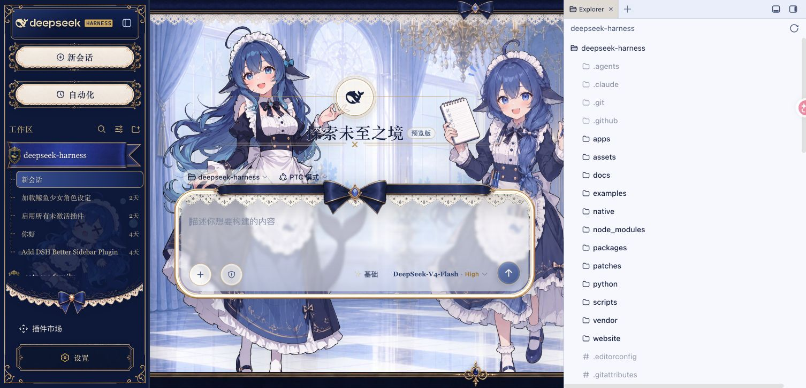
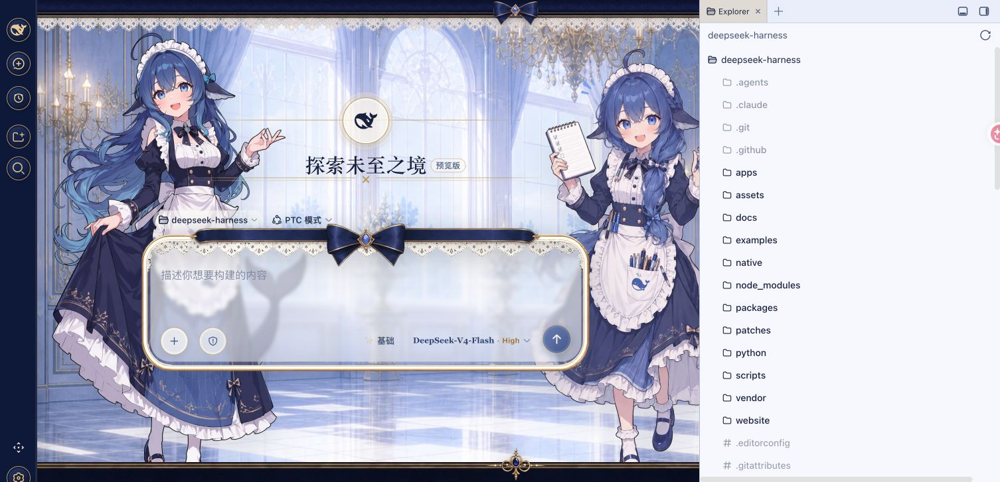
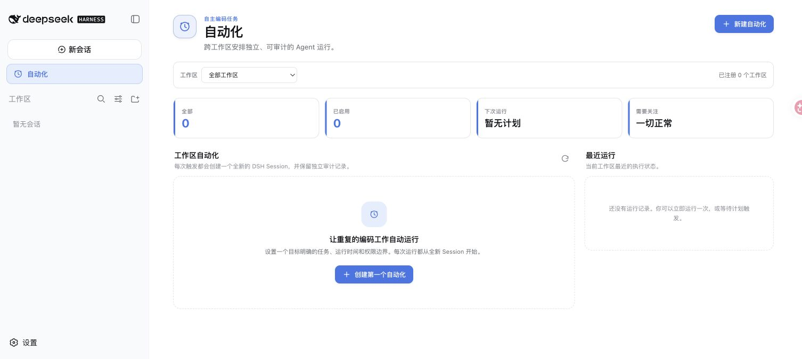
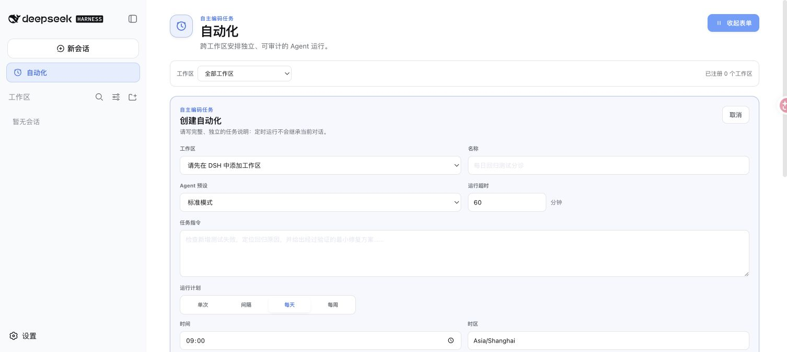

# DSH Automation Center

中文 | [English](README.en.md)

[](https://www.npmjs.com/package/dsh-automation-center)
[](LICENSE)

> 题图是“DeepSeek 鲸鱼娘与自动化”的项目插画，不是产品界面截图。下方所有功能截图均来自 DSH `0.1.0-rc.8` 的原版 DeepSeek 官方皮肤。


DSH Automation Center 是面向 [DeepSeek Harness](https://github.com/usersx/deepseek-harness) 的全局自动化任务插件。“自动化”与“新会话”同级，固定在左侧栏“新会话”下方、“工作区”上方；点击后打开完整任务中心，不需要先进入某个 Session。

每次触发都会在指定 Workspace 中创建一个全新的根 Agent 和 Result Session。任务定义、计划、权限与运行历史由 Automation Center 管理；完整结果与审计轨迹保存在 Result Session 中，并以自动化任务名作为会话标题。

> 当前版本：`0.1.0-alpha.3`。目标版本为 DSH `0.1.0-rc.8`，需要配套的 Shell Slot Patch。兼容性通过不等于安全审计通过。

## 从 npm 安装（推荐）

npm 制品已经准备完成；账号完成 2FA 发布授权后即可用一条命令安装：

```sh
dsh plugin --profile web add dsh-automation-center@latest
```

Desktop Profile：

```sh
dsh plugin --profile desktop add dsh-automation-center@latest
```

安装后完整退出并重新打开 DSH，让 Host Bundle 在启动时挂载。不要只刷新网页。

安装前请确认：

1. DSH 基于 [`agent/automation-shell-pages-rc8`](https://github.com/usersx/deepseek-harness/tree/agent/automation-shell-pages-rc8) 分支构建。
2. 已移除或停用旧的 `@dsh-external/dsh-automation`，避免两套 Scheduler 同时运行。
3. Node.js 使用 DSH 支持的 `^22.19.0` 或 `>=24.0.0`。

## 为什么需要独立的自动化中心

Session 内的自动化标签存在信息架构冲突：用户必须先进入一个会话才能管理任务，但每次执行又会创建另一个新 Session。Automation Center 把管理入口提升到全局 Shell：

- 无需先打开任何 Session；
- 跨 Workspace 查看任务、计划、最近运行和失败项；
- 使用完整根页面，而不是 Conversation 标签或弹窗；
- 每次运行都有独立、可审计、可直接打开的 Result Session；
- 入口外壳由 DSH Sidebar 统一渲染，与“新会话”保持同宽、同中心线和同皮肤。

## 功能

### 全局任务中心

- 全 Workspace 总览、Workspace 筛选、统计卡片与最近运行。
- 左侧栏根入口：展开态与“新会话”同为 252 × 38，内容中心偏移为 0；收起态同为 36 × 36。
- 点击后不增加选中底色，也不会残留鼠标焦点涂层；仍保留 `aria-current="page"` 语义。
- 失败、中断或跳过的未读运行显示注意力徽标。

### 计划与任务管理

- 一次性、固定间隔、每日和每周计划。
- 显式 IANA 时区，并使用同一 recurrence engine 预览下次运行。
- 创建、编辑、暂停、恢复、删除、立即运行和取消。
- 创建请求幂等，网络重试不会生成重复 Definition。

### Fresh Session 执行

- 每次 occurrence 创建新的根 Agent 和 Session，不复用聊天会话。
- Result Session 标题使用自动化任务名，而不是 Workspace 或项目名。
- 不继承创建者的聊天历史、父子关系或临时人工授权。
- 支持“只读”和“Workspace 可写”两种无人值守权限。
- 同一任务防重叠、确定性 occurrence 领取、有限 misfire 补偿和 Host 重启恢复。
- 持久运行历史、摘要、Result Session 入口和结构化错误码。

### 迁移与冲突保护

- 只读导入旧 `dsh_automation` v1 Definition 与 Run，原存储域保持不变。
- 迁移幂等，可以卸载新插件后回滚。
- 检测到旧 Scheduler 时明确报 `AUTOMATION_PLUGIN_CONFLICT`，不会静默启动两套调度器。

## 原版 DeepSeek 界面截图

### 1. 与“新会话”同级且居中

<p align="center">
  
  
</p>

### 2. 全局 Automation Center



### 3. 创建自动化任务



## 使用方法

1. 点击左侧栏“自动化”。
2. 点击“新建自动化”或“创建第一个自动化”。
3. 填写名称、任务指令、Workspace、计划、时区、Agent Preset、权限和超时。
4. 检查下次运行预览并保存。
5. 等待计划触发，或点击“立即运行”。
6. 在“最近运行”查看摘要，并打开 Result Session 查看完整结果。

建议先用“只读”权限和无外部副作用的小任务验证配置，再逐步开放 Workspace 写权限。

## 工作原理

```text
Sidebar 根入口
      │
      ▼
Automation Center ──RPC──▶ AutomationEngine ──▶ Definition / Run 存储
                                      │
                          计划、立即运行或恢复调度
                                      │
                                      ▼
                          Fresh Agent + Fresh Session
                                      │
                       固定任务标题、权限与 Workspace
                                      │
                                      ▼
                          Result Session + 审计记录
```

核心复杂度集中在 Host 侧 `AutomationEngine`。Client、Loopback RPC、Scheduler 和 Agent Tools 只调用 `snapshot` / `dispatch` 边界，不直接读写存储域。

## 兼容性

未经修改的上游 DSH `0.1.0-rc.8` 尚未提供真正根级页面所需的两个通用 Client Slot：

- `sidebar.primary.action`
- `shell.page`

因此当前需要 [usersx/deepseek-harness 的 rc.8 Shell Patch 分支](https://github.com/usersx/deepseek-harness/tree/agent/automation-shell-pages-rc8)。插件不会注入 DOM，也不会替换整棵 Sidebar；扩展点缺失时会明确报 `DSH_AUTOMATION_INCOMPATIBLE`。

| 目标 | 状态 |
|---|---|
| DSH `0.1.0-rc.8` + Shell Patch / Web / 原版官方皮肤 | 已观察通过 |
| 未修改的上游 DSH `0.1.0-rc.8` | 不兼容：缺少两个 Slot |
| macOS 原生 Desktop + rc.8 Patch | 尚未重新实机验收 |
| Windows / Linux 原生 Desktop | 尚未实机验收 |

精确结果与未运行项见[验收结果](docs/acceptance-results-2026-08-20.md)。

## 配置

| 配置项 | 默认值 | 说明 |
|---|---:|---|
| `maxConcurrentRuns` | `2` | 全局同时运行的最大 Run 数，范围 1–32 |
| `runTimeoutMinutes` | `60` | 默认单次运行超时，范围 1–1440 分钟 |
| `misfireGraceMinutes` | `15` | Host 暂停后的有限补偿窗口 |
| `historyLimit` | `200` | 每个 Automation 保留的 Run 上限 |
| `archiveRunSessions` | `false` | 完成后是否归档 Result Session；Run 审计行仍保留 |

## 安全边界

- 管理 RPC 只接受可信 Loopback 连接。
- UI 只能提交已注册的 Workspace ID，不能传任意宿主绝对路径。
- Automation Agent 不能递归创建 Automation，也不能等待人工授权。
- 无人值守工具使用白名单，并拒绝后台进程逃逸。
- Host 重启后不盲目重试可能已经产生副作用的中断 Run。
- 日志和 RPC 错误不得输出 Prompt、Token、环境变量或凭证。
- 取消只能终止后续执行，无法回滚已经完成的副作用。

## 开发与验证

```sh
pnpm install
pnpm check
```

当前已观察：插件测试 67 / 67 通过；配套 DSH Layout / Sidebar / Workspace 测试 216 / 216 通过；rc.8 原版皮肤浏览器实测两个展开入口同为 252 × 38、中心偏移 0px，点击后的背景与“新会话”一致。

## 文档

- [验收标准](docs/acceptance-criteria.zh-CN.md)
- [验收结果](docs/acceptance-results-2026-08-20.md)
- [技术方案](docs/technical-design.zh-CN.md)
- [实施路线](ROADMAP.md)
- [第三方代码声明](THIRD_PARTY_NOTICES.md)

## 从源码安装

```sh
git clone https://github.com/usersx/dsh-automation-center.git
cd dsh-automation-center
pnpm install
pnpm check
npm pack
dsh plugin --profile web add ./dsh-automation-center-0.1.0-alpha.3.tgz
```

## 已知限制

- 当前仍需要 rc.8 Shell Patch。
- 第一版不提供分布式 Scheduler、远程执行节点或云端凭证托管。
- 取消不会撤销已经发生的文件修改或外部调用。
- 当前仍是 Alpha；稳定版发布条件以验收文档为准。

## 许可证

[MIT](LICENSE)
