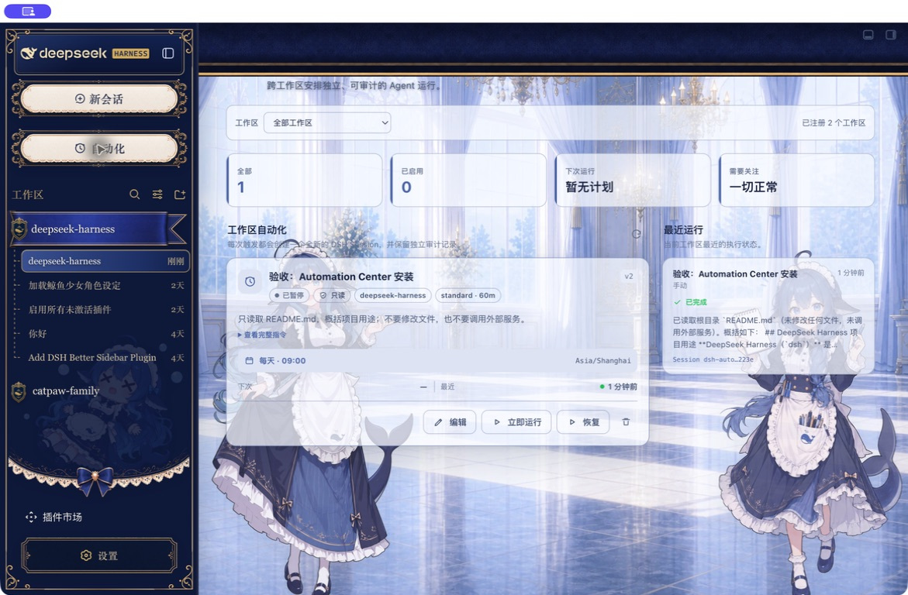

# DSH Automation Center

中文 | [English](README.md)


面向 DeepSeek Harness 的全局自动化任务中心。“自动化”是和“新会话”同级的根入口：位于左侧栏“新会话”正下方、“工作区”正上方，点开后进入完整中央页面，而不是藏在某个 Session 的“对话 / 轨迹”标签中。

每次触发都会在指定 Workspace 中创建全新的根 Agent 和 Result Session。任务定义、计划、权限和运行历史由 Automation Center 管理；Result Session 保存完整结果和审计轨迹，并直接使用自动化任务名作为会话标题。

> 当前版本是 `0.1.0-alpha.2`。它需要配套的 DSH Shell Patch，尚不兼容未经修改的上游 `0.1.0-rc.7`。Alpha 兼容性通过不等于安全审计通过。

## 为什么做这个插件

原有的 Session 内自动化入口与执行模型存在信息架构冲突：用户必须先进入一个会话才能管理任务，但每次任务运行又会创建另一个 Session。Automation Center 把管理面提升到全局 Shell：

- 不需要先进入任何 Session。
- 可以跨 Workspace 查看任务、计划和失败项。
- 管理页面不会伪装成 Conversation 标签或弹窗。
- 每个 Run 都有独立、可追踪、可打开的 Result Session。
- 入口外壳由 DSH Sidebar 统一渲染，自动继承 Better Sidebar 和当前皮肤。

## 功能一览

### 全局任务中心

- 全 Workspace 总览、Workspace 筛选、统计卡片和最近运行区。
- 根级“自动化”入口，展开态与“新会话”同宽居中，收起态使用同一圆形皮肤。
- 当前页只通过 `aria-current` 表达，不增加变色或选中背景。
- 失败或待查看 Run 的注意力徽标。

### 计划与管理

- 一次性、固定间隔、每日、每周计划。
- 显式 IANA 时区；保存前使用同一个调度引擎预览下次运行时间。
- 创建、编辑、暂停、恢复、删除、立即运行和取消。
- 创建请求幂等，连续保存或网络重试不会产生重复 Definition。

### Fresh Session 执行

- 每个 occurrence 创建新的根 Agent 和 Session，不复用聊天会话。
- Result Session 标题固定为自动化任务名，不再显示成项目名或 Workspace 名。
- 不继承创建者的聊天历史、父子关系和临时人工授权。
- 只读 / Workspace 可写两种无人值守权限。
- 同一任务防重叠、确定性 occurrence 领取、有限 misfire 补偿和 Host 重启恢复。
- 持久运行历史、结果摘要、Result Session 入口和结构化错误码。

### 迁移与冲突保护

- 只读导入旧 `dsh_automation` v1 Definition 和 Run，原存储域保持不变。
- 导入幂等，可以卸载新插件后回滚到旧数据。
- 旧 `@dsh-external/dsh-automation` 仍启用时明确报 `AUTOMATION_PLUGIN_CONFLICT`，不会静默启动两套 Scheduler。

## 界面



更多实机截图：

- [展开侧栏](docs/assets/sidebar-expanded-fixed.png)
- [折叠侧栏](docs/assets/sidebar-collapsed-fixed.png)
- [创建表单](docs/assets/create-form.png)
- [空状态](docs/assets/automation-center-empty.png)
- [Result Session 使用任务名](docs/assets/result-session-title.png)

## 工作原理

```text
Sidebar 根入口
      │
      ▼
Automation Center ──RPC──▶ AutomationEngine ──▶ 持久化 Definition / Run
                                      │
                         到期、立即运行或恢复调度
                                      │
                                      ▼
                         Fresh Agent + Fresh Session
                                      │
                        固定任务标题、权限与 Workspace
                                      │
                                      ▼
                         Result Session + 审计记录
```

核心复杂度集中在一个 Host 侧深模块：

```ts
interface AutomationEngine {
  snapshot(scope, query, signal?): Promise<AutomationSnapshot>
  dispatch(scope, command, signal?): Promise<AutomationCommandReceipt>
  readonly changes: HostObservable<AutomationChange>
}
```

Client、Loopback RPC、Scheduler 和 Agent Tools 只调用这个接口，不直接读写 Storage Domain。

## 兼容性

上游 DSH `0.1.0-rc.7` 暂未提供真正根级页面所需的两个通用 Client Slot：

- `sidebar.primary.action`
- `shell.page`

本插件因此需要 [usersx/deepseek-harness 的 `agent/automation-shell-pages` 分支](https://github.com/usersx/deepseek-harness/tree/agent/automation-shell-pages)。插件不会注入 DOM，也不会替换整棵 Sidebar；缺少扩展点时会明确报 `DSH_AUTOMATION_INCOMPATIBLE`。

已观察环境：

| 目标 | 状态 |
|---|---|
| DSH `0.1.0-rc.7` + Shell Patch / Web | 已观察通过 |
| macOS DSH Desktop 2.0.1 测试副本 | 已观察通过 |
| Better Sidebar 0.12.1 + Maid Atelier 皮肤 | 已观察通过 |
| 未修改的上游 DSH `0.1.0-rc.7` | 不兼容：缺少 Slot |
| Windows / Linux 原生 Desktop | 尚未实机验收 |

精确的通过、自动化覆盖和未运行项见[验收结果](docs/acceptance-results-2026-08-20.md)。

## 安装

### 前置条件

1. 使用带 Shell Patch 的 DSH 构建。
2. 移除或停用旧 `@dsh-external/dsh-automation`。
3. Node 使用 DSH 支持的 `^22.19.0` 或 `>=24.0.0`。

### 安装 Release 制品

Web Profile：

```sh
dsh plugin --profile web add \
  https://github.com/usersx/dsh-automation-center/releases/download/v0.1.0-alpha.2/dsh-automation-center-0.1.0-alpha.2.tgz
```

Desktop Profile：

```sh
dsh plugin --profile desktop add \
  https://github.com/usersx/dsh-automation-center/releases/download/v0.1.0-alpha.2/dsh-automation-center-0.1.0-alpha.2.tgz
```

安装后完整退出并重新打开 DSH。不要只刷新页面，因为 Host Bundle 需要在启动时挂载。

### 从源码安装

```sh
git clone https://github.com/usersx/dsh-automation-center.git
cd dsh-automation-center
pnpm install
pnpm check
npm pack
dsh plugin --profile web add ./dsh-automation-center-0.1.0-alpha.2.tgz
```

## 使用方法

1. 点击左侧栏“自动化”。
2. 点击“新建自动化”或空状态中的“创建第一个自动化”。
3. 填写名称、任务指令、Workspace、计划、时区、Agent Preset、权限和超时。
4. 检查下次运行预览，保存任务。
5. 等待计划触发，或点击“立即运行”。
6. 在“最近运行”中查看摘要，点击 Session 进入完整结果。

建议先用“只读”权限和一个无外部副作用的小任务验证配置，再逐步开放 Workspace 写权限。

## 配置

| 配置项 | 默认值 | 说明 |
|---|---:|---|
| `maxConcurrentRuns` | `2` | 全局同时运行的最大 Run 数，范围 1–32 |
| `runTimeoutMinutes` | `60` | 默认单次运行超时，范围 1–1440 分钟 |
| `misfireGraceMinutes` | `15` | Host 暂停后允许补偿的时间窗口 |
| `historyLimit` | `200` | 每个 Automation 保留的 Run 上限 |
| `archiveRunSessions` | `false` | 完成后是否归档 Result Session；审计 Run 仍保留 |

单个任务可以覆盖运行超时、Preset、模型选择和权限预设。

## 安全边界

- Web 管理 RPC 只接受可信 Loopback 连接。
- UI 只能选择已注册 Workspace ID，不能传任意宿主绝对路径。
- Automation Agent 不能递归创建 Automation，也不能等待人工授权。
- 无人值守工具使用白名单，禁止后台进程逃逸。
- Host 重启后不盲目重试可能已经产生副作用的中断 Run。
- 日志和 RPC 错误不得输出 Prompt、Token、环境变量或凭证。
- 取消只能终止后续执行，无法回滚已经产生的副作用。

## 开发与验证

```sh
pnpm install
pnpm check
```

`pnpm check` 依次执行 TypeScript 检查、Host/Web Bundle 构建、测试和仓库契约检查。当前插件测试为 67 / 67；配套 DSH Layout / Sidebar / Workspace 测试为 209 / 209。

## 文档

- [验收标准](docs/acceptance-criteria.zh-CN.md)
- [验收结果](docs/acceptance-results-2026-08-20.md)
- [技术方案](docs/technical-design.zh-CN.md)
- [GitHub 生态调研](docs/research/github-automation-landscape-2026-08.md)
- [X 需求样本](docs/research/x-automation-needs-2026-08.md)
- [实施路线](ROADMAP.md)
- [第三方代码声明](THIRD_PARTY_NOTICES.md)

## 已知限制

- 当前必须搭配 Shell Patch，不能直接安装到未经修改的上游 rc.7。
- 第一版不提供分布式 Scheduler、远程执行节点和云端凭证托管。
- 取消不会撤销已经发生的文件修改或外部调用。
- 当前仍是 Alpha；稳定版发布条件以验收文档为准。

## 许可证

[MIT](LICENSE)
